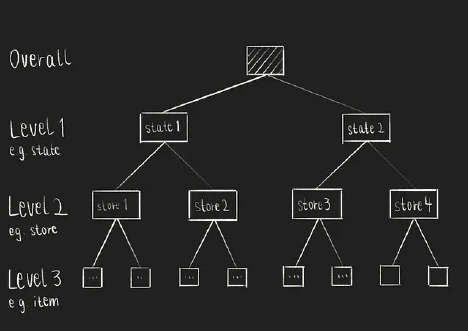
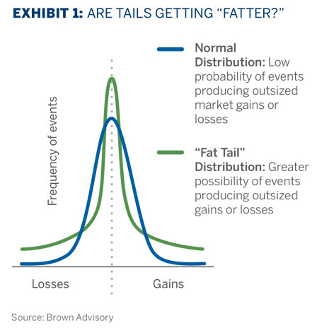
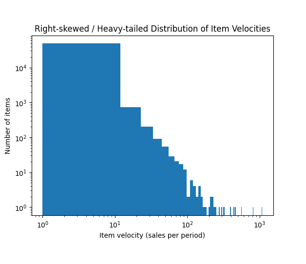
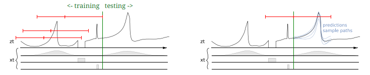

# Retail Forecasting Literature Review

Η εργασία αφορά στη μελέτη της βιβλιογραφίας και στην ανάπτυξη σύντομης παρουσίασης σχετικά με τη Πρόβλεψη Ζήτησης Προϊόντων σε Καταστήματα Λιανικής.

## Οδηγίες

Η παρουσίαση θα πρέπει να περιλαμβάνει στο τέλος λίστα βιβλιογραφίας με τα άρθρα ή ηλεκτρονικές πηγές στις οποίες στηρίζεται. Την παρουσίαση ως αρχείο pdf/ppt και το video καταγραφής της ως mp4 (max 10-12 λεπτά) θα τα υποβάλετε ο καθένας σε ξεχωριστό φάκελο που θα έχει το όνομα σας και το ΑΕΜ σας, στο ακόλουθο link https://drive.google.com/drive/folders/1psePivGOgiiwfZ9DIC5rgtxHUKoZUnJj.

## Χρήσιμοι Σύνδεσμοι

https://doi.org/10.1016/j.ijforecast.2021.11.013
https://doi.org/10.1007/s12351-020-00605-2
https://doi.org/10.1016/j.ijforecast.2021.11.001
https://doi.org/10.1016/j.ijforecast.2021.09.012

## Eισαγωγή

H πρόβλεψη πωλήσεων χρησιμοποιείται τα καταστήματα για τον προγραμματισμό του ανεφοδιασμού τους (επίπεδο καταστήματος) και της παραγωγής τους (επίπεδο αποθήκης). Πρόκειται για πρόβλεψη πολλών χρονοσειρών (όσα είναι τα προϊόντα) που μπορεί να αλληλεπιδρούν μεταξύ τους (π.χ. σε προϊόντα σουπερμάρκετ, ο πελάτης θα αγοράσει είτε γάλα πλήρες μαρκας X είτε μάρκας Y), επηρεάζονται από ποικιλία προσφορών (μείωση τιμής, εκπτώσεις, 1+1, κλπ).

Forecasts are required in Super Markets in order to define:

- Strategy
- Manage demand, to avoid customer service issues, lost sales and low profits
- Manage stock supply, to reduce inventory costs

The data comprises aligned, highly-correlated series structured in a hierarchical fashion. complex, nonlinear relationships between series, as well as including exogenous/explanatory variables.

## Όροι

**Hierarchical unit sales** refers to sales data structured in a multi-level grouping system, often used for forecasting, planning, reporting, and organizing sales teams. Unlike common multivariate time series problems, hierarchical time series can be aggregated on different levels: e.g., item level, store level, and state level.

**Light Gradient-Boosting Machine (LGBM)** is a free and open-source distributed gradient-boosting framework for machine learning, originally developed by Microsoft. It is based on decision tree algorithms and used for ranking, classification and other machine learning tasks. It is commonly adopted by retail firms to improve the accuracy of their sales predictions and daily operations.

**Exponential Moving Average (or Exponential Smoothing)** is an Optimizer, i.e. an algorithm or method used to minimize an error function (loss function). It gives exponentially decreasing weights to past observations, making *recent data more influential* for predicting the future than older data, unlike simple moving averages which weigh all points equally. It hence captures seasonality.

Exponential smoothing is an "off-the shelf" standard forecasting method that is readily available in most types of statistical software for anyone to use.

**The Root Mean Squared Scaled Error (RMSSE)** is a variant of the mean absolute scaled error (MASE), where we square and then take the root of errors. Scaling means taking into account the difference between each time point, by dividing by their mean. Normalizing means adjusting each error by dividing it by the observed sales.

**One-step naive forecast** means predicting the next period's value will be exactly the same as the most recent actual value, δηλαδή θεωρώ την διαφορά τους ως «error», και αυτό βάζω στον παρονομαστή του RMSSE.

$RMSSE = \sqrt{\frac{\frac{1}{h} \sum_{t=n+1}^{n+h} (y_t - \hat{y}_t)^2}{\frac{1}{n-1} \sum_{t=2}^n (y_t - y_{t-1})^2}}$

- It is symmetric in the sense that it penalizes equally positive and negative forecast errors.
- It is therefore important to keep the values in a timeseries prior to the start of the selling of a product as na rather than 0, or RMSSE will calculated for them, too.

**Global models:** models that learn from the entire dataset to understand average behavior.

**Naive forecast** is Future sales = most recent observed sales, δηλαδή:

$\hat{y}_{t+h} = {y}_t$

όπου `h`: forecast horizon (in days)

**Generalized Linear Models (GLM)** are flexible statistical frameworks that extend traditional linear regression to handle response variables (outcomes) that aren't normally distributed.

**Autoregressive (AR) models** predict future values in a sequence by using a linear regression of past values (lags) from the same variable, essentially modeling a variable's history to forecast its future behavior.

**Recurrent Neural Networks**: The output of a neuron at one time step is fed back as input to the network at the next time step. This enables RNNs to capture temporal dependencies and patterns within sequences.

recursive = recurrent = επαναλαμβανόμενος. Παίρνει προηγούμενα outputs ως inputs του επόμενου layer.

autoregressive = παίρνει προηγούμενες τιμές (values, όχι outputs) για να προβλέψει την επόμενη.

**Mean** shows accuracy and **standard deviation** shows stability.

**Kurtosis** is a measure of the risk of normally remote possibilities actually occurring. Ιτ happens when the probability of extreme outcomes rises, causing the tails on the bell curve to be elevated or “fattened.” Ιt measures the aggregate probability that outcomes in the two tails will occur: the greater the kurtosis, the more likely it is that extreme outcomes will come to pass.

{width=60%}

**Cross-learning** = Global modelling, pooled learning. It's applicable in this case because we have a) the same nature of time series (retail) b) the same frequency c) hierarchical structure d) the same period of examination.

**ARMA**: The autoregressive (AR) component specifies that the current value of the series depends linearly on its own past values (lags), while the moving average (MA) component specifies that the current value depends on a linear combination of past error terms. ARMA works with stable (stationary) data, while ARIMA adds an "Integrated" (I) component, using differencing to make non-stationary data (with trends) stable before applying ARMA.

**latent state**: an underlying, unobservable condition or variable that influences observable data but isn't directly measured.

**covariates**: συναλλοιωτές, variables that influence the target in a study but aren't the main focus.

## Traditional Practices

One decomposes the overall forecasting problem into a number of distinct forecasting sub-problems and applies a dedicated model or even a chain of models to each one. However, the forecasting problem might not lend itself to a decomposition into a sequence of distinct procedures, in which case one would have to think about model consolidation, blending, or ensembling. These techniques increase the complexity still further.

## Methodology

One can simply forecast the series at the most disaggregated level of the competition and derive the remaining forecasts using a bottom-up approach. Alternatively, one might only forecast the most aggregated series (level 1) and compute the remainder using proportions (top-down method). A mixture of these two approaches is also possible (middle-out method).

## Error Assessment

Regarding assessing the forecasting accuracy, those based on *scaled errors* probably have the most appropriate statistical properties.

In general, performing methods deteriorate at a lower aggregation level because the uncertainty increases when forecasting more disaggregated data with volatile sales, and patterns such as trend and seasonality are difficult to capture. In the lowest aggregation levels (10, 11, and 12) accuracy deteriorates significantly as the forecasting horizon increases, too. Longer-term trends are easier to observe at higher aggregation levels.

The weights for the WRMSSE are computed based on the cumulative actual dollar sales in each series (i.e. each product) in that particular period - hence offer more value to the companies by accounting more for higher-selling products.

We need to consider the full distributions of forecasting errors and especially their tails when evaluating forecasting methods, thereby indicating that robustness is a prerequisite for achieving high accuracy. That should be accounted for when cross-validating.

## Exogenous factors

$y_t​=f(history of y)+g(exogenous factors_t​)+ε_t​$

- is_christmas

- is_black_friday

- promo_active

- store_closed

However, Walmart's operating costs were not factored in.

## Forecasting methods of the winning teams

Many of these sequences include intermittent sales having many zeros as well as high-volume sales. Intermittent data forecasting is concerned with sequences in which values appear sporadically.

1. Equal weighted combination (arithmetic mean) of 3 LightGBM models at the level of Store, Department and Category, with 2 variations (recursive & non-recursive) for each, adding up to 6 for each time series.
- Pooled per store: The model learns patterns that are shared across items of a specific store, for example sales on Sundays, or holidays and weather effects.
- **Recursive ('επαναληπτικό') Forecasting:** A *recursive approach* generates multi-step forecasts by feeding previous predictions back into the model, whereas a *non-recursive approach* predicts each future horizon step directly without using its own forecasts as inputs.
- Early stopping is a technique used during the training of machine learning models to prevent overfitting. Instead of training for a fixed number of epochs, early stopping monitors the model's performance on a validation set and halts training when performance begins to degrade.
- Υπέθεσε πως οι χρονοσειρές ακολουθούν κατανομή Tweedie. Η κατανομή Tweedie για p > 1 γίνεται εκθετική, δηλαδή η συνάρτηση μάζας - πιθανότητάς της ανήκει στην Exponential Dispersion Family.
- i.i.d.: independent and identically distributed (προέρχονται από τον ίδιο πληθυσμό) variables = random sample.

According to his validations, the recursive models in his approach were more accurate on average than the non-recursive models but with greater instability. 

2. In this case, 10 LightGBM models were trained per store (pooled per store) and 5 N-BEATS multipliers were used to capture trends.

**N-BEATS**: a neural network that also predicts weekly sales and is especially good at capturing trends (i.e. upward/downward movement over time). In practice, we multiply LightGBM forecasts by some multiplier to bring them in line with N-BEATS trends. The reason is that the LightGBM model might be good at capturing seasonal patterns and short-term fluctuations (e.g. promotions), but not long-term trends. The multiplier adjusts the LightGBM outputs to match the trend predicted by N-BEATS. The concept can be summed as reconciling the forecasts produced at different aggregation levels.

**Why use several multipliers**

Each series of the product-store level (the lowest level) in the data set was forecast using a combination of five different models. Rather than using one multiplier for all weeks, one might choose to split the forecast horizon into segments (e.g., short-term, medium-term, long-term) and apply a different multiplier to each. This allows the adjusted forecasts to capture changing trends over time, rather than using a single static factor. For example, 5 multipliers could correspond to Weeks (1–2, 3–4, 5–6, 7–8, 9–10), where each segment gets its own multiplier derived from N-BEATS vs LightGBM predictions.

Loss function used: An asymmetric loss function penalizes overprediction and underprediction differently, unlike standard symmetric losses (like Mean Squared Error) that treat both errors equally. These functions are crucial in applications where one type of error is more costly.

No recursive (autoregressive) use of sales data in the LightGBM models, so there no dependence on previous forecasts to generate the next one. This helps to a) avoid forecast errors being propagated over the horizon and b) Long-range forecasts to remain stable.

3. This method used DeepAR, a specific type of recurrent neural network (RNNs) designed to model sequential data over time

For advanced time-series forecasting, Amazon Corporation developed a state-of-the-art probabilistic forecasting algorithm which is known as the Deep Autoregressive or DeepAR forecasting algorithm. This is one kind of Deep Learning model that is specifically designed to capture the inherent uncertainties associated with future predictions, with the ability to extract features from high-dimensional inputs. Unlike traditional forecasting methods that rely on deterministic point estimates, DeepAR provides a probability distribution over future values, allowing decision-makers to assess the range of possible outcomes and make more informed decisions.

Each neural network in the ensemble was built by stacking multiple Long Short Term Memory (LSTM) layers. These are specialized types of Recurrent Neural Networks (RNN) designed to learn and remember patterns in sequential data over long periods. The name of LSTMN reflects its key capabilities:

- Short-term memory: the ability to retain recent information from the sequence (e.g., the last few time steps).

- Long-term memory: the ability to preserve important information over long time spans and prevent it from being overwritten or forgotten.

24 of the models employed dropout, whereas 19 didn't. Dropout randomly deactivates neurons during training to reduce overfitting. However, if e.g. the dataset is large enough or other methods of overfitting (such as early stopping) are employed, it might not be needed.

CV here: last fourteen 28 day-long windows of available data (28 x 14 = 392 days).

**Calibrating forecasts**

Εach LSTM is trained to output parameters of a probability distribution for future demand. So for *every future time step*, the model outputs a full predictive distribution, i.e. a mean parameter with possibly dispersion parameters. The NNs considered 100 features.

For each model $i$, horizon $h$, and series we have a Tweedie probability distribution $\tilde{y}_{i,h}$. We then draw $S$ samples:

$$\tilde{y}_{i,h}^{(1)}, \dots, \tilde{y}_{i,h}^{(S)}$$	​

These samples represent possible future demand paths. We optimize the weights for the 43 NNs of the final model by training on these samples; so optimal and not equal combination weights are used in the final model.

**Γιατί δημιουργώ τεχνητές μελλοντικές προβλέψεις;**

The predictive distributions originate from the LSTM models themselves, which are trained to output full probability distributions for future demand. Θεωρούμε δηλαδή πως κάθε μοντέλο έχει κάνει ικανοποιητικές προβλέψεις (τις περάσαμε και από cross-validation), που κατ' εκτίμηση αποτυπώνουν τις πιθανές μελλοντικές τιμές.
We then draw samples from those distributions με ίσες πιθανότητες για την τιμή που πρόβλεψε το κάθε μοντέλο (καθώς έχουμε ένα equal-weight ensemble) and create a target class for the 28 days. We then create a Tweedie General Linear Model where the inputs (features) are the 43 models, with weights applied to each, in order to get the targets we set.
Το τελικό μας μοντέλο είναι δηλαδή ένα παραμετρικό μοντέλο, με τα χαρακτηριστικά του να είναι νευρωνικά μοντέλα, καθένα από τα οποία έχει 100 χαρακτηριστικά.

Είναι ένας τρόπος βελτιστοποίησης των μελλοντικών προβλέψεων καθώς:
- Δεν υπάρχουν διαθέσιμες προβλέψεις για το μελλοντικό διάστημα των 28 ημερών, όμως οι προβλέψεις από το ensemble των μοντέλων καλύπτουν αυτό το διάστημα, με τα ιδιαίτερα χαρακτηριστικά του (π.χ. αργίες ή εποχικότητα). Έτσι μπορούμε να βελτιστοποιήσουμε τις προβλέψεις για το test.
- Μπορούμε να εξασφαλίσουμε πως οι προβλέψεις θα έχουν την κατανομή που θέλουμε (π.χ. Tweedle), με τον αντίστοιχο αριθμό μηδενικών τιμών ή διακύμανσης.
- Αποφεύγουμε την υπερπροσαρμογή σε θόρυβο των δεδομένων εκπαίδευσης.

**Γιατί παίρνω δείγμα από ένα μοντέλο και όχι τον μέσο όρο τους;**

Για να διατηρήσω την αβεβαιότητα και την τυχαιότητα στην εκπαίδευση του GLM. Διαφορετικά θα είχα «εξομαλυμένες» προβλέψεις, χωρίς ακραίες ή μηδενικές τιμές.

4. Εδώ έχουμε ένα non-recursive LGBM μοντέλο για κάθε Store (άρα 10 στο σύνολο). Το κάθε ένα από αυτά τα μοντέλα διαφοροποιήθηκε για τις 4 εβδομάδες των προβλέψεων, άρα συνολικά δημιουργήθηκαν 40 μοντέλα. Ως Cross Validation χρησιμοποιήθηκαν οι 5 τελευταίες περίοδοι 28 ημερών των δεδομένων εκπαίδευσης.

5. Σε αυτή την περίπτωση είχαμε εκπαίδευση μοντέλων ανά τμήμα καταστήματος (π.χ. τρόφιμα, είδη σπιτιού, ρούχα), άρα 7 μοντέλα. Οι μελλοντικές τιμές των προβλέψεων που λήφθησαν για κάθε προϊόν στη συνέχεια προσαρμόστηκαν ώστε ο μέσος όρος τους (των τιμών δηλαδή των 10 καταστημάτων) να είναι ίσος με τον μέσο όρο των δεδομένων εκπαίδευσης, για τις τελευταίες 28 ημέρες.
Validation: Τυχαίο δείγμα 500 (!) ημερών.

**link function in GLMs**

In generalized linear models, there is a *link function*, which is the link between the *mean* of Y on the left and the fixed component on the right, μια συνάρτηση που συνδέει τον μέσο όρο της μεταβλητής στόχου με τα δεδομένα εισόδου.

$f(μ_{Y|X}) = β_{0} + β_{1}X$

π.χ. $ln(μ) = β_{0} + β_{1}X$ => $μ = e^{(β_{0} + β_{1}X)}$

**Γιατί χρησιμοποιώ την Maximum Log Likelihood;**

Θέλω να βρω μια συνάρτηση που περιγράφει την κατανομή των δεδομένων μου ώστε:

- Να μπορώ να κάνω νέες προβλέψεις

- Να μπορώ να εκτιμήσω την επίδραση των χαρακτηριστικών

- Να μπορώ να υπολογίσω σφάλματα και διαστήματα εμπιστοσύνης

## Conclusions

The results support the long-standing belief that combining forecasts obtained with different methods can improve the forecasting accuracy and they also confirm that there is no guarantee that an "optimal" forecast combination will perform better than a simpler,
equal-weighted one.

Πλεονέκτημα έναντι άλλων μεθόδων:

- Το να μην διαλέγεις χειρωνακτικά τα μοντέλα βάση αυτοσυσχέτισης, τάσεων και εξωγενών παραγόντων (avoid selecting and preparing covariates and selecting models that classical techniques require).
- Κάνει πιθανοτικές προβλέψεις αντί για σημειακές.

## DeepAR

It's an autoregressive, Recurrent Neural Network, which means it can model the sequential nature of time series data. It's a global model, so it learns from the whole dataset to understand behaviour. RNNs are generally deterministic, in the sense that for the same x, $h_{(t-1)}$ and $θ$ they produce the same output. However, we can make their output probabilistic by sampling from a likelihood distribution (e.g. Tweedie or Negative Binomial).

Issues to resolve:

- Different magnitude of sales per item (item velocity).

- Lack of homoscedasticity, stationarity and Gaussianity of data.

This makes binning or normalization very difficult.

The poisson distribution assumes that the mean ~ variance = λ. The Negative Binomial (NB) introduces an (extra) dispersion parameter that allows a greater variance and is used for count time series ($y \in \{1, 2, 3 \dots\}$). The Tweedie distribution is used for sales time series, as it's continuous ($y \in \mathbb{R}$).

Normally, to capture complex behaviour of time series we would utilize a) manual covariates with one-hot encoding (e.g. is it holidays?) b) Fourier terms such as sin(2πkt/24) and cos(2πkt/24) for daily cycles, and sin(2πkt/168) and cos(2πkt/168) for weekly cycles, where \(t\) is time and \(k\) is the harmonic number (1, 2, 3...). The latter here is mostly obsolete.

The model produces probabilistic outputs using Monte Carlo simulation. That means it's run many times, each run produces a plausible future trajectory and the collection of these trajectories approximates the forecast distribution.

It also employs Long Short-Term Memory layers to alleviate the vanishing or exploding gradient problem. As an RNN, it also allows for encoding and decoding of different lengths.

RNNs

The transit (or transition) function 𝑓(⋅) defines how the system moves (transits) from one state to the next.

$$h_t = f(h_{t-1}, x_t; \theta)$$

Where:

* $h_{t-1}$: The **previous state** of the system.
* $x_t$: The **external input** (or driving signal) at time $t$.
* $\theta$: The **parameters** of the model (representing the weights and biases).

An RNN is defined by a recurrence of the form:

$$h_t = f(W_h h_{t-1} + W_x x_t + b)$$

* The same weight matrices ($W_h, W_x$) and bias ($b$) are used at every time step $t$.
* This shared parameter logic is what defines the recursive (or recurrent) structure.

## Covariate Classifications in Time Series Forecasting

### (a) Static Covariates (Time-Invariant)
*Constant for each time series regardless of the time step.*

::: {.callout-note appearance="simple"}
#### Examples
* **IDs:** Store ID, household ID, product category
* **Location:** Geographic region
* **Attributes:** Demographic cluster, sensor type
:::

**Purpose**
* Allows parameter sharing across heterogeneous series.
* Lets the RNN/Model condition on specific series identity.

**Implementation**
* Typically **embedded** (categorical) or **normalized** (continuous).
* Fed to the network at every time step to maintain "memory" of the series type.

---

### (b) Known Future Covariates (Deterministic or Planned)
*Information known for all future horizons at the time of prediction.*

::: {.callout-tip appearance="simple"}
#### Examples
* **Calendar:** Day-of-week, month, holidays
* **Commercial:** Price schedules, promotions, planned events
* **Environmental:** Weather forecasts (if assumed known/fixed)
:::

**Purpose**
* Enables the model to learn systematic future effects (e.g., "What happens to sales when this holiday occurs next week?").
* Essential for high-accuracy long-horizon forecasting.

---

### (c) Past-Only Covariates (Observed Exogenous Inputs)
*Observed historically but unknown for the future periods.*

::: {.callout-important appearance="simple"}
#### Examples
* **Historical Data:** Past weather (if no forecast is available)
* **Correlated Series:** Past demand ofß

## Latent States in Time-Series Modeling

When the state $x_t$ is **latent**, it means that the variable representing the system's condition at time $t$ is not directly observed or measured. Instead, its value must be inferred indirectly through a mathematical model, based on other related, observable variables. 

---

### DeepAR Architecture

In **DeepAR**, the model utilizes a single Recurrent Neural Network (RNN) architecture across the entire time horizon.

The model is run in two distinct stages:

1.  **Encoder Phase:** Run on past observed data to "prime" the hidden state.
2.  **Decoder Phase:** Run on future time steps to generate probabilistic forecasts.

**Crucially, the following remain identical across both phases:**

* **Transition Function:** The same function $h(\cdot)$ is used to update the hidden state.
* **Parameters:** The same learned parameters $\Theta$ are applied throughout.
* **Likelihood Model:** The same probabilistic model is used to map the RNN output to the observed data distribution.

---

---

This concept is central to various statistical and machine learning models, especially those dealing with time-series data:

* **Hidden Variables:** Latent variables are also referred to as hidden, unobserved, or missing variables.
* **State-Space Models:** In a state-space model, $x_t$ typically represents an underlying true state (e.g., a vehicle's precise location and velocity), while the available data are noisy observations $y_t$ (e.g., GPS readings with some error) that depend on $x_t$.
* **Inference:** The primary goal of such models is to estimate the likely values of the latent state $x_t$ given the observed data $y_t$. Algorithms like the **Kalman filter** or **particle filters** are used for this inference.

Examples:
Animal Behavior: Ecologists use hidden Markov models to infer an animal's unobserved behavior (the latent state) from observed data like location time stamps.
Finance: A company's "financial health" might be considered a dynamic latent state, inferred from observable cash flow data.

---

### Comparison: State-Space Models vs. DeepAR

The relationship between "Encoder" and "Decoder" differs significantly depending on the model architecture:

#### In Latent State-Space Models:
* **Encoder $\approx$ Inference Network:** Responsible for mapping observations to the latent state.
* **Decoder $\approx$ Generative Model:** Maps the latent state back to the observation space.
* **Separation is Fundamental:** The process of "guessing" the hidden state (inference) is mathematically distinct from "evolving" the state forward (generation).

#### In DeepAR:
* **Deterministic State:** The hidden state is a direct, deterministic output of the RNN.
* **Trivial Inference:** Since there is no latent randomness in the state itself, "inferring" the state is simply a forward pass of the network.
* **Separation Collapses:** The distinction between encoding and decoding becomes purely temporal rather than structural.

---

> **One-sentence takeaway:** > Because DeepAR uses the same deterministic RNN with shared parameters $\Theta$ before and after the forecast origin, the encoder–decoder split is only a conceptual convenience, not a real modeling distinction.

---

For each time series in the dataset, we generate multiple training instances by selecting from the original time series windows with different starting points. In practice, we keep both the total length T and the relative lengths of the conditioning and prediction ranges fixed for all training examples. For example, if the total available period for a given time series ranges from 2013-01-01 to 2017-01-01, we can create training examples where t = 1 corresponds to 2013-01-01, 2013-01-02, 2013-
01-03, and so on. When choosing these windows, we
ensure that the entire prediction range is always covered by the available ground truth data, but we may
chose to have t = 1 lie before the start of the time
series, e.g. 2012-12-01 in the example above, padding
the unobserved target with zeros. This allows the model
to learn the behavior of ‘‘new’’ time series by taking
into account all other available covariates. Augmenting
the data using this windowing procedure ensures that
information about absolute time is available to the model
only through covariates, not through the relative position
of zi,t in the time series. Fig. 4 contains a depiction of this
data augmentation technique

DeepAR trains on sliding windows of fixed length. For some windows:

the left edge of the window lies before the actual start of a time series,

the unobserved target values are padded with zeros

In this way, we create a situation where This explicitly simulates a new item:

no past sales,

only covariates available (time, category, price, etc.). This is critical in retail, where new items constantly appear.

### The Recursive Evolution of DeepAR

In **DeepAR**, the hidden state of the model evolves according to a deterministic transition function:

$$h_{i,t} = h(h_{i,t-1}, z_{i,t-1}, x_{i,t})$$

This transition shows that the next hidden state depends directly on the previous observed value $z_{i,t-1}$, allowing the model to generate predictions step-by-step.

#### Behavior at Inference Time
During the forecasting (decoder) phase, the future values $z_{i,t}$ are unknown. To bridge this gap, the model must feed its own predictions back into itself:

1. **Sampling:** A value is sampled from the likelihood distribution: $\tilde{z}_{i,t} \sim p(\cdot \mid \theta(h_{i,t}))$.
2. **Feedback Loop:** This sampled value $\tilde{z}_{i,t}$ is used as the input to compute the subsequent hidden state $h_{i,t+1}$.

---

### Robustness: Time Series vs. NLP
A primary concern with feeding predictions back into a model (Auto-regressive decoding) is that errors can **accumulate** and **compound** over time.

| Feature | Natural Language Processing (NLP) | Time Series (DeepAR) |
|---------|-----------------------------------|-----------------------|
| **Error Impact** | A single wrong word early on can derail an entire sentence. | Small errors are less likely to cause a "blow up." |
| **Data Nature** | Discrete and highly sensitive to syntax. | Continuous, smoother, and locally correlated. |

::: {.callout-note}
**The Empirical Observation:** The authors of DeepAR claim that because time series are generally "smoother" and adjacent values are highly correlated, the model is inherently more robust to the compounding error problem than typical sequence-to-sequence models in NLP.
:::

---

### power-law of scales

### Handling Power-Law Data and Scaling

Power-law data presents a significant challenge for neural networks because values can vary over several orders of magnitude—ranging from the very small (e.g., $0.001$) to the very large (e.g., $1000$).

[Image of power law distribution vs normal distribution]

#### The Problem: Activation Saturation
Neural networks rely on non-linear activation functions that are only effective within specific "active" ranges. Outside of these windows, the functions **saturate**, meaning their output becomes flat and they fail to propagate useful gradients during training.

| Activation Function | Effective Range (approx.) | Behavior Outside Range |
|---------------------|---------------------------|-------------------------|
| **Tanh** | $[-3, 3]$                 | Saturates at $-1$ or $1$ |
| **Sigmoid** | $[-5, 5]$                 | Saturates at $0$ or $1$  |
| **ReLU** | $[0, \infty)$             | Constant $0$ for all negative inputs |

If an input is extremely large (like $1000$), the network views it as "out of range," leading to a breakdown in learning.

#### The Solution: Scaling and Inversion
To process this data effectively, the model must perform a two-step transformation:

1.  **Input Scaling:** Scale the input down to a range the hidden layers can handle.
    * *Example:* Mapping an observed value $z_{i,t-1} = 1000$ to an internal value of $1$.
2.  **Output Re-scaling (Inversion):** Invert that scaling at the output layer so the predicted mean $\mu$ is returned to the original scale of $z_{i,t}$.

::: {.callout-tip}
In DeepAR, this is often handled automatically by a "scaling factor" $\nu_i$ derived from the average value of the time series, ensuring the network always "sees" values close to 1 regardless of the original units.
:::

### The DeepAR Scaling Mechanism

To handle data spanning multiple orders of magnitude, DeepAR implements a per-series scaling factor $\nu_i$. 

#### 1. Defining the Scaling Factor
For each time series $i$, the scaling factor $\nu_i$ is calculated based on the average value of the observations in the conditioning range:

$$\nu_i = 1 + \frac{1}{t_{10} - t_0} \sum_{t=t_0}^{t_{10}} z_{i,t}$$

* **The "Average":** This is essentially the mean of the first $n$ observations (e.g., the first 10 time steps).
* **The $+1$ Constant:** This is added to prevent division by zero or extremely small numbers in series that may be entirely composed of zeros.

#### 2. Input Transformation
Instead of feeding the raw observations $z_{i,t}$ directly into the RNN, the model uses normalized inputs:

$$\tilde{z}_{i,t} = \frac{z_{i,t}}{\nu_i}$$

By dividing the inputs by $\nu_i$, the network processes values that are generally centered around a similar scale (often close to $1$), regardless of whether the original series measured units in the thousands or in decimals.

#### 3. Output Re-scaling
To ensure the final probabilistic forecast is on the original scale, the distribution parameters produced by the model are scaled back up. For example, if the model predicts a mean $\tilde{\mu}_{i,t}$, the final prediction is:

$$\mu_{i,t} = \tilde{\mu}_{i,t}

Secondly, the imbalance in the data means that a
stochastic optimization procedure that picks training instances uniformly at random will visit the small number
time series with large scales very infrequently, resulting in those time series being underfitted. This could be
especially problematic in the demand forecasting setting, where high-velocity items can exhibit qualitatively
different behaviors from low-velocity items, and having
accurate forecasts for high-velocity items might be more
important for meeting certain business objectives. We
counteract this effect by sampling the examples nonuniformly during training. In particular, our weighted
sampling scheme sets the probability of selecting a window from an example with scale νi proportional to νi. 

---

### Categorical Covariates and Embeddings

DeepAR handles item-specific information through **learned embeddings** rather than traditional one-hot encoding. This allows the model to capture complex relationships between products without the dimensionality "explosion" associated with thousands of unique IDs.

#### 1. Why use Embeddings?
Instead of representing a category like "clothing" as a sparse one-hot vector $[1, 0, 0, \dots]$, the network learns a **dense vector** (e.g., $[0.12, -0.54, 0.91]$). 

* **Example 1:** Product categories (e.g., "electronics", "furniture").
* **Example 2:** Specific Item IDs (e.g., "item_001", "item_002").

#### 2. Feature Composition
Each data point at time $t$ is represented by a feature vector $x_{i,t}$ that combines different types of information:

* **Age:** Numeric value representing time elapsed since the series began.
* **Day-of-Week:** Numeric or categorical feature (e.g., $0$–$6$).
* **Item Embedding:** The learned $d$-dimensional vector representing the specific item.

#### 3. Input Vector Example
For "item_001" on a Monday (day $0$) at its very first observation (age $0$), with a 2-dimensional learned embedding $[0.12, -0.54]$, the input vector $x$ is constructed via concatenation:

$$x = [\text{age}, \text{day-of-week}, \text{embedding}_1, \text{embedding}_2]$$
$$x = [0, 0, 0.12, -0.54]$$

---

### Hyperparameters

a grid-search is used to find the best
value for the hyper-parameters item output embedding
dimension and # of LSTM nodes (e.g. hidden number of
units). 

---

### Probabilistic Forecasting via Autoregressive Sampling

DeepAR does not output a single point estimate; it produces a **parametric probability distribution** at each time step. This allows the model to quantify uncertainty through a multi-step sampling process.

#### 1. Predicting the Distribution
At each time step $t$, the network predicts the parameters of a distribution $p_\theta$ (e.g., Gaussian or Negative Binomial) conditioned on past values and covariates:

$$p_\theta(z_t \mid z_{1:t-1}, \text{covariates})$$

The RNN outputs the distribution parameters—such as the mean $\mu_t$ and standard deviation $\sigma_t$—rather than a scalar value $z_t$.

#### 2. The Monte Carlo Sampling Process
To generate a forecast over a horizon $H$, DeepAR uses an iterative **Monte Carlo sampling** approach:

* **Step 1: The Forecast Origin**
    We begin with observed data up to time $T$: $\{z_1, z_2, \dots, z_T\}$.
* **Step 2: Generate the First Sample**
    The last observation $z_T$ and current covariates are fed into the RNN. The model outputs a distribution for $z_{T+1}$. We draw a single sample:
    $$\tilde{z}_{T+1} \sim \text{Gaussian}(\mu_{T+1}, \sigma_{T+1})$$
* **Step 3: Autoregressive Roll-forward**
    The sampled value $\tilde{z}_{T+1}$ is fed back into the network as the input for the next time step. We then sample $\tilde{z}_{T+2}$ from the new resulting distribution. This repeats until we reach $z_{T+H}$.
* **Step 4: Path Generation**
    By repeating this entire process $N_{\text{samples}}$ times (e.g., 100 times), we generate a collection of possible future trajectories:
    $$\{\tilde{z}_{T+1}^{(i)}, \dots, \tilde{z}_{T+H}^{(i)}\}_{i=1}^{N_{\text{samples}}}$$

---

### Interpreting the Results
From these $N$ trajectories, we can derive actionable statistical insights for any future time step:

| Metric | Description |
|--------|-------------|
| **Median Forecast** | The $0.5$ quantile of all sampled trajectories. |
| **Prediction Intervals** | The range between lower (e.g., $0.1$) and upper (e.g., $0.9$) quantiles. |
| **Risk Assessment** | The probability of the series exceeding a specific threshold. |

::: {.callout-important}
Because each step $t+1$ depends on a *sample* from $t$, the trajectories can diverge, naturally capturing the increasing uncertainty the further we look into the future.
:::

### Case Study: Q4 Volatility and Uncertainty in Retail

In retail, the fourth quarter (October–December) represents a period of peak complexity. The significant increase in uncertainty during this time is primarily driven by intense seasonality and demand variability.

#### 1. Seasonal Spikes and Event Irregularity
Q4 is defined by high-impact shopping events that create sharp, non-linear spikes in demand:
* **Major Events:** Black Friday, Cyber Monday, Christmas, and Hanukkah.
* **Predictive Challenge:** These events are "point-in-time" shocks. Unlike stable weekly patterns, the exact magnitude and timing of these spikes can vary based on the calendar year, making them harder to model with simple averages.

#### 2. Increased Demand Volatility
The variance of demand increases significantly in Q4, leading to two primary issues:
* **Product-Specific Surges:** Categories like toys, electronics, and apparel see unpredictable jumps.
* **Supply-Demand Mismatch:** High volatility leads to binary outcomes—either rapid stockouts or unexpected overstock.

#### 3. Modeling the "Extreme"
Standard models trained on "average" periods (Q1–Q3) often struggle with Q4 because:
* **Distribution Shift:** The extreme deviations in Q4 are often outliers relative to the rest of the year.
* **Wider Distributions:** In a probabilistic model like DeepAR, this uncertainty is reflected in the **widening of the prediction intervals** (the "fan" effect), signaling to planners that a single-point estimate is unreliable.

::: {.callout-tip}
### The DeepAR Advantage
Because DeepAR learns a global model across many series, it can leverage patterns from "electronics" to help predict "toys" during Q4, even if a specific toy has no previous holiday history.
:::

Coverage is used to examine whether our forecasts can meet demands.

Coverage(p)=fraction of observations zt​ below the p-th forecast quantile z^t

p: ποσοστιαίο σημείο
coverage: πόσων προϊόντων το 0.9 ποσοστιαίο σημείο της κατανομής τους είναι μεγαλύτερο από την πραγματική τιμή.

π.χ. αντι να πω πως θέλω η μέση πρόβλεψη να είναι μεγαλύτερη από τη μέση ζήτηση για ένα προϊόν, λέω πως θέλω το 0.9 ποσοστιαίο σημείο της κατανομής της πρόβλεψης για ένα προϊόν να είναι μεγαλύτερο από την πραγματική τιμή του. Δηλαδή το 90% των προβλέψεων για εκείνη τη χρονική στιγμή είναι μεγαλύτερες από την πραγματική τιμή;

Η Παλινδρόμηση Ποσοστιαίων Σημείων (Quantile Regression) είναι μια ισχυρή στατιστική μέθοδος που μοντελοποιεί σχέσεις μεταξύ μεταβλητών, όχι μόνο στον μέσο όρο (όπως η κλασική παλινδρόμηση), αλλά σε διάφορα ποσοστιαία σημεία (π.χ., 10%, 50% - διάμεσος, 90%) της κατανομής της εξαρτώμενης μεταβλητής, αποκαλύπτοντας πώς οι ανεξάρτητες μεταβλητές επηρεάζουν τα άκρα και το κέντρο της κατανομής, ιδανική για δεδομένα με ετεροσκεδαστικότητα (διαφορετική διακύμανση) ή μη κανονική κατανομή. 

Coverage(p) for each percentile p, which is defined as the fraction of time series in the dataset for which the p-percentile of the predictive distribution is larger than the true target. For small percentiles (like 10th percentile), the check is trivial: most observations will be above it, giving low coverage, which is less informative.

When you decide to plan using the 0.9 percentile of the forecast distribution, you are saying:

“I am willing to accept a 10% probability that true demand exceeds my plan.”

Equivalently:

In expectation, you will meet demand in 90% of cases

You are explicitly pricing in uncertainty, rather than pretending the forecast is exact. It's a way to control risk.
| Product | Mean | Variance | 0.9-quantile |
| ------- | ---- | -------- | ------------ |
| A       | 100  | Low      | ≈ 105        |
| B       | 100  | High     | ≈ 140        |
The 0.9 percentile reacts to variance, while the mean does not.

For larger percentiles (e.g., 90th or 95th):

These correspond to the upper tail, where capturing extreme values is harder.

Ensuring coverage in the tail is critical for inventory, safety stock, or risk management.

Mis-calibration in the upper tail leads to underestimating high demand or spikes.